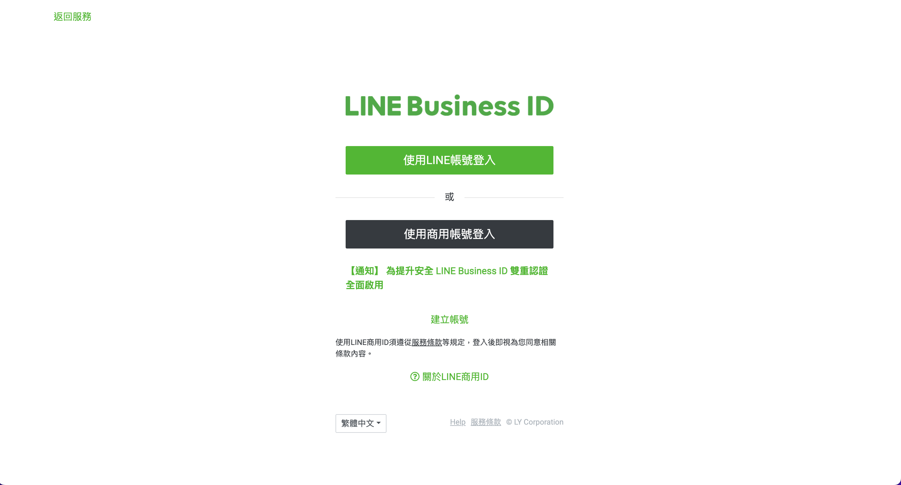

# Line Bot 建立流程

我們將一步一步指導你如何建立一個新的 Line Bot 帳戶，並完成基本設定。

## 1. 進入 Line Business 頁面

首先，前往 [Line Business](https://developers.line.biz/en/?status=success) 官方網站，這是 Line Bot 開發者專用的後台管理平台。

## 2. 登入並進入 Console

在頁面的右上角，找到並點擊 **Console** 按鈕，進入 Line Bot 後台控制台。

## 3. 進入後台控制台

系統會將你引導至後台管理畫面，在這裡可以管理和創建你的 Line Bot 專案。

## 4. 選擇 Providers

在控制台頁面中，找到並點擊 **Providers**，我都想成這是用來管理多個專案的文件資料夾。

## 5. 創建新的 Provider

輸入一個你定義的 Provider 名稱。

## 6. 創建 Message API Channel

選擇你剛剛創建的 Provider，接著在頁面中間位置找到並點擊 **Create a Message API channel**，以創建一個 Message API 機器人來管理訊息傳遞。

## 7. 創建 Line Official Account

系統會引導你創建一個 **Line Official Account**，這是你的 Line Bot 與使用者互動所需的官方帳號，點擊 **Create a Line Official Account** 來開始。

## 8. 填寫帳號基本資訊

系統會要求你填寫 Line Official Account 的基本資訊，如名稱、類別、國家等。根據實際需求進行填寫。

## 9. 確認並創建

確認你所填寫的資訊無誤後，點擊 **確定** 以完成帳號創建。

## 10. 完成 Line Bot 設定

創建完成後，系統會顯示一個確認訊息，代表你的 Line Bot 已成功建立。

## 11. 設定 Line Bot

最後，你可以進入 Line Bot 的設定介面，進行 webhook URL 設定、回應訊息設定等。

